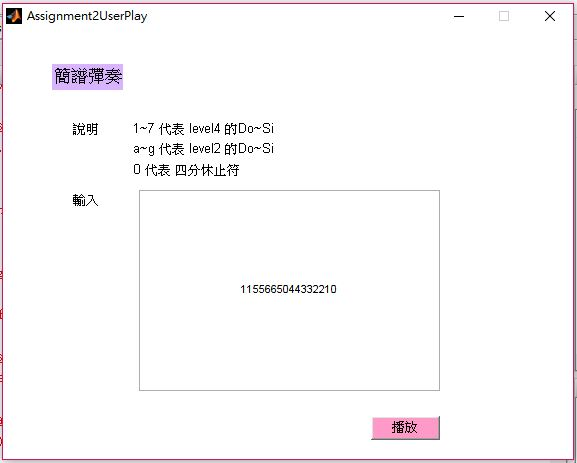
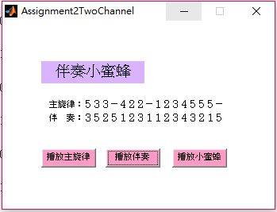
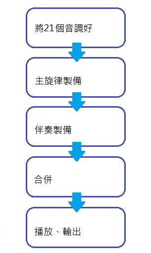

# MMS2017FALL/Assignment2
音訊處理

##  作業內容簡介
<ol><li>使用者輸入簡譜可播放(Assignment2UserPlay.m)</li>
    <li>不同採樣率的小蜜蜂(Assignment2DifferentFs.m)</li>
    <li>雙頻道的音樂輸出(Assignment2TwoChennel.m)</li>
</ol>

##  成果報告
因為GUI介面製作尚不熟悉的問題，只好將使用者輸入簡譜以及同時伴奏的功能分開製作。

### 使用者輸入簡譜可播放

    在這裡使用者可以輸入自己想輸的音符，按下播放後即放出音樂。

* The format I design for the input text file of musical notes

    使用者將輸入1-7代表level4的Do-Si、a-g代表level2的Do-Si，

    在此程式中只有用到四分音符，所以轉換如下：

使用者輸入|程式中的命名||使用者輸入|程式中的命名
:---:|:---:|:---:|:---:|:---:
1|AltoDo4||a|BassoDo4
2|AltoRe4||b|BassoRe4
3|AltoMi4||c|BassoMi4
4|AltoFa4||d|BassoFa4
5|AltoSol4||e|BassoSol4
6|AltoLa4||f|BassoLa4
7|AltoSi4||g|BassoSi4

* The flowchart of User Playing Mode

* The way to set up and run My program

    這次使用Matlab來製作，首先先置備好level2及level4中的四分音符，

    因不是要做作曲功能的程式，所以在這裡沒有做其他音符。

    製成音符步驟如下：

    公式：x(t) = A sin(2πft)
    1. 設置震幅大小：A = 1
    2. 頻率根據Level Table設置：

        Freq2 = [65 73 82 87 98 110 124]

        Freq4 = [262 294 330 349 392 440 494]
    3. Sample Frequency設置：fs = 8000
    4. 四分音符的時間：T4 = (1 : 0.25 * fs) / fs
    5. 音符製作範例

        四分休止符：Zero4 = A * sin(2 * pi * 0 * T4)

        四分二階Do：BassoDo4 = A * sin(2 * pi * Freq2(1) * T4)

        四分四階Do：AltoDo4 = A * sin(2 * pi * Freq4(1) * T4)

### 雙頻道的音樂輸出

    可播放單有主旋律的小蜜蜂、純伴奏的小蜜蜂、合奏的小蜜蜂。

* The format I design for the input text file of musical notes

    在此程式中音符命名方式為：

階級|唱名|拍數
:---:|:---:|:---:
Basso|Do|4
二階|Do|四分音符
Alto|La|2
四階|La|二分音符

    因為小蜜蜂的伴奏並無使用到二分音符，因此只做21個音，雖說很多音也沒被用到，但為整體性還是製作。

* The flowchart of User Playing Mode

* The way to set up and run My program

    這次使用Matlab來製作，首先先置備好level2的四分音符及level4的二分音符、四分音符，

    製成音符步驟如下：

    公式：x(t) = A sin(2πft)
    1. 設置震幅大小：A = 1
    2. 頻率根據Level Table設置：

        Freq2 = [65 73 82 87 98 110 124]

        Freq4 = [262 294 330 349 392 440 494]
    3. Sample Frequency設置：fs = 8000
    4. 二分音符的時間：T2 = (1 : 0.5 * fs) / fs
        四分音符的時間：T4 = (1 : 0.25 * fs) / fs
    5. 音符製作範例

        四分二階Do：BassoDo4 = A * sin(2 * pi * Freq2(1) * T4)

        二分四階Do：AltoDo2 = A * sin(2 * pi * Freq4(1) * T2)

        不做休止符是因為可以用0代替。

##  比較與心得
使用者輸入做休止符但兩頻輸出的不做
發現自己做的好像不是老師要的qwq
和在一起有雜訊好討厭
