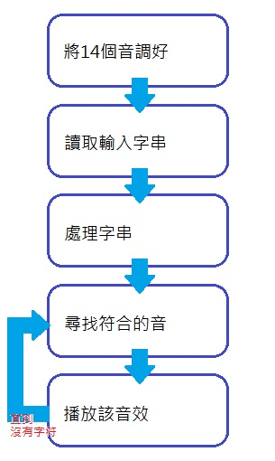

# MMS2017FALL/Assignment2
音訊處理

##  作業內容簡介
使用者輸入簡譜可播放 [Assignment2UserPlay.m]

不同採樣率的小蜜蜂 [Assignment2DifferentFs.m]

雙頻道的音樂輸出 [Assignment2TwoChennel.m]

  [Assignment2UserPlay.m]: https://github.com/PeiShanYang/MMS2017FALL/blob/master/Assignment2/Assignment2UserPlay.m
  [Assignment2DifferentFs.m]: https://github.com/PeiShanYang/MMS2017FALL/blob/master/Assignment2/Assignment2DifferentFs.m
  [Assignment2TwoChennel.m]: https://github.com/PeiShanYang/MMS2017FALL/blob/master/Assignment2/Assignment2TwoChennel.m

##  成果報告
因為GUI介面製作尚不熟悉的問題，只好將使用者輸入簡譜以及同時伴奏的功能分開製作。

### 使用者輸入簡譜可播放

    在這裡使用者可以輸入自己想輸的音符，按下播放後即放出音樂。

* The format I design for the input text file of musical notes

    使用者將輸入1-7代表level4的Do-Si、a-g代表level2的Do-Si，

    在此程式中只有用到四分音符，所以轉換如下：

使用者輸入|程式中的命名||使用者輸入|程式中的命名
:---:|:---:|:---:|:---:|:---:
1|AltoDo4||a|BassoDo4
2|AltoRe4||b|BassoRe4
3|AltoMi4||c|BassoMi4
4|AltoFa4||d|BassoFa4
5|AltoSol4||e|BassoSol4
6|AltoLa4||f|BassoLa4
7|AltoSi4||g|BassoSi4

* The flowchart of User Playing Mode

* The way to set up and run My program

    這次使用Matlab來製作，首先先置備好level2及level4中的四分音符，

    因不是要做作曲功能的程式，所以在這裡沒有做其他音符。

    製成音符步驟如下：

    公式：x(t) = A sin(2πft)
    1. 設置震幅大小：A = 1
    2. 頻率根據Level Table設置：

        Freq2 = [65 73 82 87 98 110 124]

        Freq4 = [262 294 330 349 392 440 494]
    3. Sample Frequency設置：fs = 8000
    4. 四分音符的時間：T4 = (1 : 0.25 * fs) / fs
    5. 音符製作範例

        四分休止符：Zero4 = A * sin(2 * pi * 0 * T4)

        四分二階Do：BassoDo4 = A * sin(2 * pi * Freq2(1) * T4)

        四分四階Do：AltoDo4 = A * sin(2 * pi * Freq4(1) * T4)

### 不同採樣率的小蜜蜂

* 採樣率8000與44100比較

    選擇市面上常見的44100與8000比較。
    
    [採樣率8000]
    
  [採樣率8000]:https://github.com/PeiShanYang/MMS2017FALL/blob/master/Assignment2/fs8000LittleBee.wav

   [採樣率44100]
  
  [採樣率44100]:https://github.com/PeiShanYang/MMS2017FALL/blob/master/Assignment2/fs44100LittleBee.wav

    相比之下，採樣率8000的小蜜蜂後面連續的Sol便會比較斷斷續續，但44100的小蜜蜂則不會。

### 雙頻道的音樂輸出

    可播放單有主旋律的小蜜蜂、純伴奏的小蜜蜂、合奏的小蜜蜂。
    
   [主旋律小蜜蜂]、[純伴奏小蜜蜂]、[合奏的小蜜蜂]
   
  [主旋律小蜜蜂]:https://github.com/PeiShanYang/MMS2017FALL/blob/master/Assignment2/fs8000LittleBee.wav
  [純伴奏小蜜蜂]:https://github.com/PeiShanYang/MMS2017FALL/blob/master/Assignment2/fs8000LittleBeeBack.wav
  [合奏的小蜜蜂]:https://github.com/PeiShanYang/MMS2017FALL/blob/master/Assignment2/fs8000LittleBeeMix.wav

* The format I design for the input text file of musical notes

    在此程式中音符命名方式為：

階級|唱名|拍數
:---:|:---:|:---:
Basso|Do|4
二階|Do|四分音符
Alto|La|2
四階|La|二分音符

    因為小蜜蜂的伴奏並無使用到二分音符，因此只做21個音，雖說很多音也沒被用到，但為整體性還是製作。

* The flowchart of User Playing Mode

* The way to set up and run My program

    這次使用Matlab來製作，首先先置備好level2的四分音符及level4的二分音符、四分音符，

    製成音符步驟如下：

    公式：x(t) = A sin(2πft)
    1. 設置震幅大小：A = 1
    2. 頻率根據Level Table設置：

        Freq2 = [65 73 82 87 98 110 124]

        Freq4 = [262 294 330 349 392 440 494]
    3. Sample Frequency設置：fs = 8000
    4. 二分音符的時間：T2 = (1 : 0.5 * fs) / fs
        四分音符的時間：T4 = (1 : 0.25 * fs) / fs
    5. 音符製作範例

        四分二階Do：BassoDo4 = A * sin(2 * pi * Freq2(1) * T4)

        二分四階Do：AltoDo2 = A * sin(2 * pi * Freq4(1) * T2)

        不做休止符是因為可以用0代替。

##  比較與心得
第一次使用Matlab，發現可以簡易的做出GUI覺得很有趣，但對他還是陌生。以後再多接觸，希望下次能用得更好。

* 比較：休止符製作的有無

  使用者輸入簡譜可播放與雙頻道的音樂輸出，前者有做休止符，但後者沒有。
  
  因在製作使用者輸入簡譜可播放時遇到了沒辦法順利將使用者輸入的字符用case判斷後，新增音符進陣列裡。
  
  試著找過解決方法後，發現無果，於是便將原本要坐在一起的合奏也分開成兩個。
  
  所以前者因應使用者會輸入休止符得另外製作，而後者因為音調是直接寫在程式中的，所以用0即可代替休止符。
  
  而且0同時也可填充陣列元素不夠的空間。
  
* 比較：fs=8000||44100

  原先在聽兩者前半段比較沒有差異，但當連音出現時，採樣率較低的便會明顯出現斷續。
  
* 心得：雙頻道的音樂輸出雜訊問題

  在這個程式中輸出的主旋律的小蜜蜂、純伴奏的小蜜蜂都沒有雜訊的感覺，
  
  但融合在一起後雜訊便變得很嚴重，取樣率改成44100後又稍淡了些。
  
  
  
  下次可以試著將雜訊剝除。

* 心得：途中發現離題

  雖然老師的Guide非常詳細，但基於這次對於不知道要用什麼工具來作業的我而言，帶著過度緊張的心做錯題目了。
  
  即是－－雙頻道的音樂，以為這次題目要融出一首有伴奏的鋼琴曲XD
  
  盼未來要看清題目再開始動手做，而且不要將事情太嚴重化了。

* 心得：學到了什麼

  首先，學到的必定是Matlab的使用，原來GUI介面這麼好建立呀！但這次還沒辦法看懂Matlab內建給介面的程式，
  
  希望可以看懂下次自己寫一個。
  
  再來，對於傅立葉轉換不再陌生了。
  
      fs = 8000;
      dt = 1/fs;
      T16 = 0.125;

      t16 = [0:dt:T16];
      [temp k] = size(t16);

      t4 = linspace(0,4*T16,4*k);
      [temp i] = size(t4);

      % Modification functions
      mod4 = sin(pi*t4/t4(end));

      % 1/4 notes
      AltoDo4 = mod4.*cos(2*pi*Freq4(1)*t4);
      
  但最後還是直接用公式做了，覺得還是比較直觀。

  最後，就是第一次知道原來程式可以發出聲音，完全沒有做過，既新鮮又好玩！！
