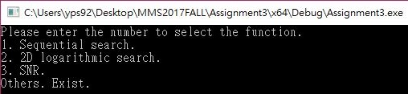
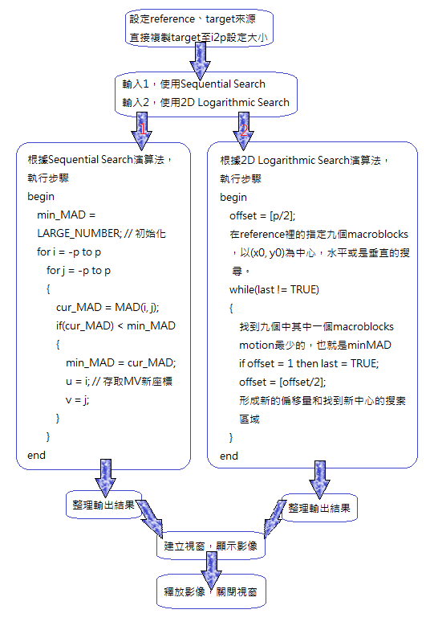
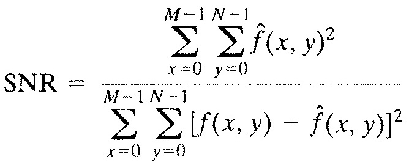

# MMS2017FALL/Assignment3
Motion Compensation

## 簡介
1. Find the motion vector for every 16x16 macroblock on the reference image and the target image using the sequential search. Set the size of the search window to 31x31, then output the prediction frame (P-frame, named with i2p) of the target frame i2.
2. Find the motion vector for every 16x16 macroblock on the reference image and the target image using the 2D logarithmic search. Set the size of the search window to 31x31, then output the prediction frame (P-frame, named with i2p) of the target frame i2.
3. Compare the speed and the SNRs of the predicted frames obtained with the two different motion vector searching algorithms.

## 結果

### 程式介紹

* 程式介面

* 程式使用方式

  輸入1，使用Sequential Search
  
  輸入2，使用2D Logarithmic Search
  
* 程式基本架構

### Two input images

* Reference

* Target

### Sequential Search

* i2p

### 2D Logarithmic Search

* i2p

## 討論

* Speed

  Sequential Searchc 耗時 3800ms
  
  2D Logarithmic Search 耗時 1004ms
  
  2D Logarithmic Search較Sequential Search快4倍
  

* SNRs

  

* 模糊程度

  2D Logarithmic Search較Sequential Search模糊得非常多，判斷是因為格數劃分剛好讓它往更失真的方向演算，
  
  因此沒有Sequential Search來得滑順。
  
  此外也有可能是演算法應用錯誤，才造成這個結果。

## 心得
