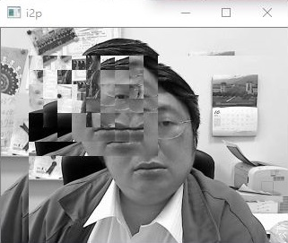

# MMS2017FALL/Assignment3
Motion Compensation

## 簡介
1. Find the motion vector for every 16x16 macroblock on the reference image and the target image using the sequential search. Set the size of the search window to 31x31, then output the prediction frame (P-frame, named with i2p) of the target frame i2.
2. Find the motion vector for every 16x16 macroblock on the reference image and the target image using the 2D logarithmic search. Set the size of the search window to 31x31, then output the prediction frame (P-frame, named with i2p) of the target frame i2.
3. Compare the speed and the SNRs of the predicted frames obtained with the two different motion vector searching algorithms.

## 結果

### Two input images

* Reference

* Target

### Sequential Search

* i2p

### 2D logarithmic search

* i2p

## 討論

## 心得
