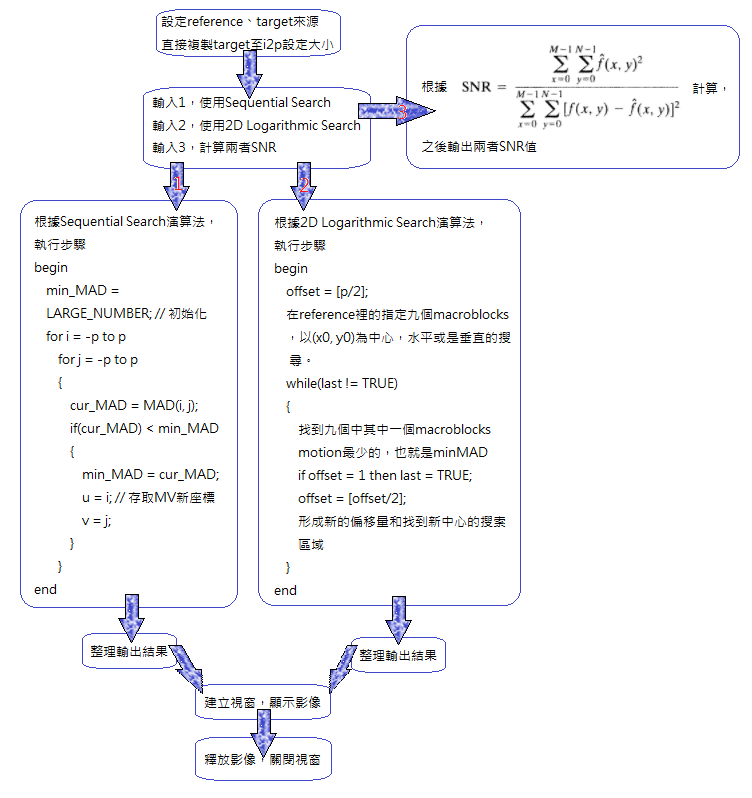

# MMS2017FALL/Assignment3
Motion Compensation

## 簡介
1. Find the motion vector for every 16x16 macroblock on the reference image and the target image using the sequential search. Set the size of the search window to 31x31, then output the prediction frame (P-frame, named with i2p) of the target frame i2.
2. Find the motion vector for every 16x16 macroblock on the reference image and the target image using the 2D logarithmic search. Set the size of the search window to 31x31, then output the prediction frame (P-frame, named with i2p) of the target frame i2.
3. Compare the speed and the SNRs of the predicted frames obtained with the two different motion vector searching algorithms.

## 結果

### 程式介紹

* 程式介面

* 程式使用方式

  輸入1，使用Sequential Search
  
  輸入2，使用2D Logarithmic Search
  
  輸入3，計算Sequential Search及2D Logarithmic Search的SNR值
  
* 程式基本架構

### Two input images

* Reference

* Target

### Sequential Search

* i2p

### 2D Logarithmic Search

* i2p

## 討論

* Speed

  Sequential Searchc 耗時 3800ms
  
  2D Logarithmic Search 耗時 1004ms
  
  2D Logarithmic Search較Sequential Search快4倍
  

* SNRs

  雖2D Logarithmic Search較Sequential Search模糊，
  
  但在信噪比上，2D Logarithmic Search比Sequential Search小。

* 模糊程度

  2D Logarithmic Search較Sequential Search模糊得非常多，判斷是因為格數劃分剛好讓它往更失真的方向演算，
  
  因此沒有Sequential Search來得滑順。
  
  此外也有可能是演算法應用錯誤，才造成這個結果。

## 心得

　　理論與實際的結合並沒有想像中的那麼簡單，感覺上課聽老師說都很容易理解，但一旦時做起來便會有很多Bug出現。像是在MAD計算的部分以及SNR計算時，就有出現資料結構不符合，而一直改架構的情況。幸虧現在網路發達而且班上同學很樂於討論，才可以順利的把作業做完。
  
　　這學期做了三次作業，其中最印象深刻的果然還是小蜜蜂，那是一個令人難忘的回憶～每次作業的過程中都會感到自己還是太淺了，想要再努力一些、再多接觸一些，以讓自己成為更厲害的人！希望未來還有機會上老師的課，這學期真的過得很充實，學習到很多呢！
